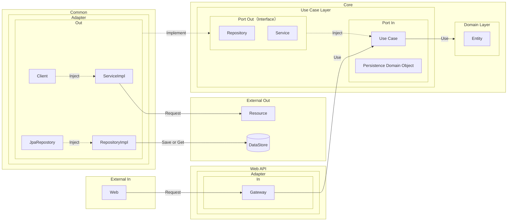

# Overview
This repository demonstrates a Clean Architecture implementation using Quarkus with Kotlin.

# Architecture
### References
1. Clean Architecture
2. Hexagonal Architecture

### Diagram

```mermaid
graph LR
	subgraph External Out
		resource[Resource]
		data-store[(DataStore)]
	end
		
	subgraph External In
		web[Web]
	end
	
	subgraph web-api[Web API]
        subgraph web-api-adapter[Adapter]
            subgraph web-api-adapter-in[In]
                web-api-adapter-in-gateway[Gateway]
            end
        end
    end
	
	subgraph common[Common]
        subgraph common-adapter[Adapter]
            subgraph common-adapter-out[Out]
                common-adapter-out-service-impl[ServiceImpl]
                common-adapter-out-repo-impl[RepositoryImpl]
                common-adapter-out-client[Client]
                common-adapter-out-jpa-repo[JpaRepostory]
            end
        end
    end
	
	subgraph core[Core]
		subgraph domain-layer[Domain Layer]
			Entity
		end
		subgraph use-case-layer[Use Case Layer]
            subgraph port-out[Port Out（Interface）]
                port-out-repo[Repository]
                port-out-service[Service]
            end
            subgraph port-in[Port In]
				use-case[Use Case]
				pdo[Persistence Domain Object]
			end
		end
	end
	
	web -- Request --> web-api-adapter-in-gateway
	
	web-api-adapter-in-gateway -- Use --> use-case
	use-case -- Use --> domain-layer
	common-adapter-out-client -. Inject .-> common-adapter-out-service-impl
	common-adapter-out-jpa-repo -. Inject .-> common-adapter-out-repo-impl
	common-adapter-out -. Implement .-> port-out
	port-out -. Inject .-> use-case
	
	common-adapter-out-repo-impl -- Save or Get --> data-store
	common-adapter-out-service-impl -- Request --> resource
```
